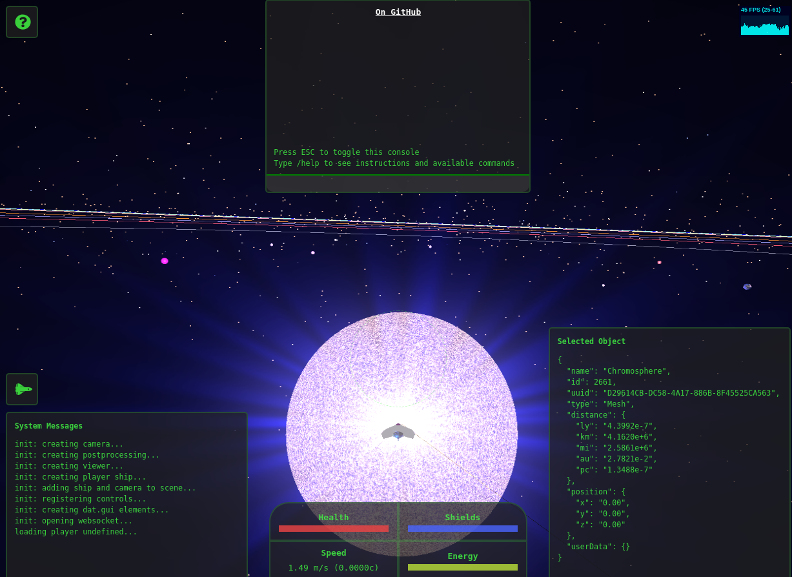

# Void

A physics-based space simulation and multiplayer game.



## Getting Started

This project currently consists of a website and an API/websocket server. Redis is also used for pub/sub to broadcast socket events to all connected browsers/clients.

### Docker compose

In this directory, you can fire up the system using `docker-compose`:

```console
cp .example.env .env
docker-compose up
```

The site should then be accessible at http://localhost:9000 in your browser.

### Plain docker/podman

```bash
# Build the website and start a server to serve it
podman build . --file dockerfile -t void
podman run -it -p 9000:9000 void
```

```bash
# Create a shared network: redis <--> void-api
podman network create void

podman run --name redis --net void redis

cd server
podman build . --file Dockerfile -t void-api
podman run -it --net void -p 1137:1137 -e REDIS_URL="redis://redis" void-api
```

The site should then be accessible at http://localhost:9000 in your browser.

### Node

If you want to develop new features and take advantage of auto-reloading, this project requires Node.js `18.x` and `npm`.

If you're in Ubuntu:

**Dev**

If you're using `python3` and you get `node-gyp` errors during `npm install` you might need to `apt install python-is-python3` or similar.

```console
sudo apt install -y build-essential libgl-dev libxi-dev python
npm install
npm run dev
```

The commands above will serve the site at http://localhost:9000 using webpack dev server.

If you also want to start the API:

```console
docker run -d -p 6379:6379 --name redis redis
cd server
npm install
npm start
```

This will use `nodemon` to start the API server on port `1137` by default.

The API depends on redis for events. If you don't want to use `docker` install and start redis on your machine using your preferred method or set the `REDIS_HOST` environment variable to point to a remote redis instance, e.g.:

```console
REDIS_HOST=redis://remote npm start
```

## Static site builds

You can produce a static build of the website using webpack:

```
NODE_ENV=production npm run build
```

Environment variables are read from `.env` by default. See the example file for details on what each variable does.

You can also override variables on the command line as in the build example above.

### GPU.js errors

When compiling a static site for production, you may get strange shader errors that weren't present during development, e.g.:

```
Error: Error compiling fragment shader: ERROR: 0:404: ’!‘ : wrong operand type - no operation ’!‘ exists that takes an operand of type lowp int (or there is no acceptable conversion) ERROR: 0:404: ’&&‘ : wrong operand types - no operation ’&&‘ exists that takes a left-hand operand of type ’bool‘ and a right operand of type ’void‘ (or there is no acceptable conversion) 
```

What's happening is webpack is transforming certain JS code to a different syntax. Since GPU.js works by transforming JS to shader code, sometimes the webpack transformation breaks the GPU.js shader compilation.

The "solution" is to wrap GPU.js kernel functions with string backticks so the kernel function is passed as a string. 

Unfortunately, this breaks syntax highlighting, eslint, etc. while developing. If desired, remove the string backticks, then remember to turn the kernel functions back into strings.
